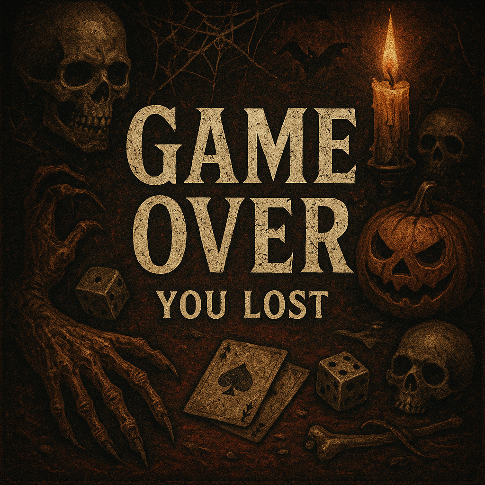
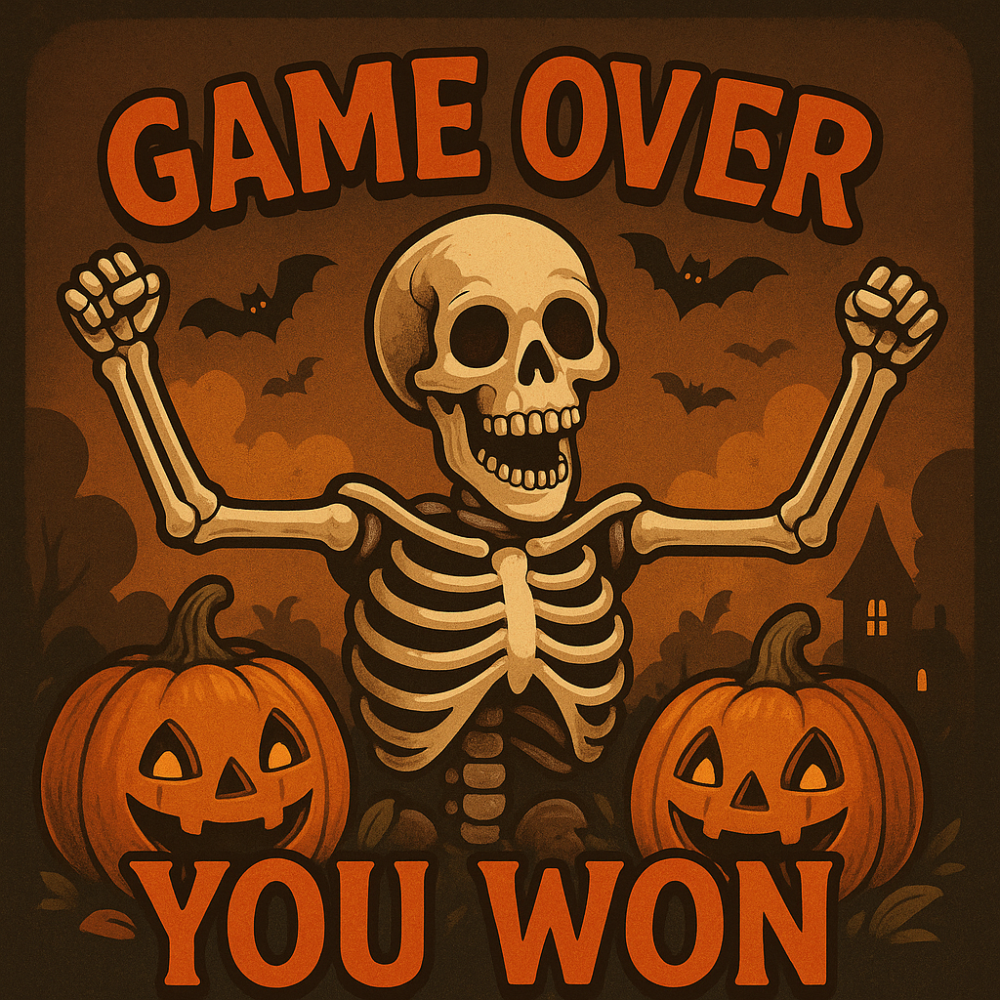

♠️ Poffer Card Game – IUT Final Project

🎮 Overview
Poffer Card Game is a two-player strategic card game designed and developed as the final project for the Advanced C++ Programming course at Isfahan University of Technology.
This game showcases the integration of OOP principles, multithreading, Qt framework, sockets, and STL containers in C++.
It offers real-time gameplay over a local network between two clients connected to a central server and includes features such as 
player registration, login, match history, pause/resume, smart card handling, and a rich set of card combination rankings inspired by poker.

🚀 Features

  🔐 User Registration & Login with input validation
  📜 Match History: Stores last 3 matches with outcomes
  🎯 Matchmaking: Auto-pairs players for 2-player games
  🃏 52-card Deck System with 4 suits and 13 cards per suit
  🏆 10 Unique Card Combinations from Golden Hand to Messy Hand
  🔁 Card Trade Requests between players
  ⏸️ Pause & Resume Functionality (20-second timeout)
  ❌ Exit & Disconnection Handling (60-second grace period)
  ⌛ AFK Detection: Auto-play on inactivity
  🧠 Polymorphic Game Logic and smart comparison algorithms
  💬 (Bonus) In-game chat & sticker support (optional)
  🖥️ Multithreaded Server & Client Communication
  
  🏅 Card Combination Rankings
     From strongest to weakest:
     Golden Hand (Bitcoin → King → Queen → Soldier → 10 of same suit)
     Order Hand (Sequential cards of same suit)
     4+1 Hand (Four cards with same number + kicker)
     Penthouse Hand (Three of a kind + two of another)
     MSC Hand (All same suit, unordered)
     Series (Sequential cards, mixed suits)
     3+2 Hand (Three of a kind + two kickers)
     Double Pair
     Single Pair
     Messy Hand
     Tie-breaks follow card rank > number > suit (Diamond > Gold > Dollar > Coin)

 🔧 How to Build & Run
    Prerequisites:
    Qt 5.15+ (or 6.x)
    CMake (or use .pro with Qt Creator)
    Git

  📌 Notes
     Player data and match history are saved locally.
     AFK players are auto-handled by timeouts and automatic card selection.
     This project was guided by Mr. Golestanfar from IUT.

  🧪 Bonus Features (Optional)
     4-player support with extended logic
     In-game chat with sticker system
     Clean code, animations, and responsive UI
     UML diagrams and architecture docs

  📥 Installer
      An installer is available in the release/ folder

Some pictures of the game:

